# Playwright Automation Framework

End-to-end test automation framework built with **Playwright** and **TypeScript**, using the [Cypress Real World App](https://github.com/cypress-io/cypress-realworld-app) as the system under test.

This is a portfolio project demonstrating hands-on automation engineering and architectural thinking: from concrete implementation decisions to org-wide tooling standards.

---

## Engineering Decisions

Key architectural and tooling decisions are documented as ADRs in [`docs/decisions/`](./docs/decisions/ADRs.md).

---

## Structure

```
playwright/
├── tests/              # Test specs — business flows only, no implementation detail
│   ├── login.spec.ts
│   └── ...
├── pages/              # Page objects — UI interactions and locators
│   ├── login.ts
│   ├── ...
├── constants/          # Shared data — users, env validation
│   └── users.ts
├── docs/
│   └── decisions/      # Architecture Decision Records — see ADRs.md
├── playwright.config.ts
└── .github/workflows/  # CI pipeline
    └── playwright.yml
```

---

## Test Strategy

- Check valid and invalid data flows
- Check errors
- Validate across different browser/device configurations
    - Note: For a production application, device choice should be driven by real usage data.
- Parallel tests
- Page Object Model. Keep tests readable as business flows and isolates the cost of UI changes to the page layer.

---

## CI / CD

GitHub Actions workflow on manual and automatic triggers (`workflow_dispatch`, `push`,`pull_request`).

Pipeline steps:
1. Checkout → Node.js setup
2. Clean dependency install
3. Install browser binaries
4. Run tests with secrets injected from GitHub repository settings
5. Upload HTML report as build artifact (planned)

Credentials are never hardcoded. The `.env.example` file documents required variables; the actual `.env.local` (staging/prod/etc) is gitignored, and the CI uses GitHub Secrets.


*CI/CD Diagram - Status: Proposed*


---

## Quality Gates

*Status: Proposed*




For a real system, the capacity of the system on different environments, the budget of the team, and how critical the system and the change is, would instruct how to articulate the quality gate that's adequated for the team and the system.

---

## Roadmap

### Test framework
- Fixtures for shared test setup (authenticated sessions, pre-seeded data)
- API-based test data setup to reduce UI dependency
- Expanded coverage: transactions, bank account management, notifications
- Push/PR triggers in CI
- Visual regression testing
- Flaky test detection and mitigation strategy

### Code quality and developer tooling
- ESLint + Prettier with pre-commit hooks via Git Hooks and lint-staged
- [Conventional Commits](https://www.conventionalcommits.org/en/v1.0.0/) format enforced via commitlint
- Automated CHANGELOG generation from commit history using [`conventional-changelog`](https://github.com/conventional-changelog/conventional-changelog)
- Automated dependency updates for applications and automation repos (evaluate different tools, e.g.: Dependabot Renovate Bot)
- Security vulnerability scanning: `npm audit` in CI as a baseline; Snyk or Depfu for deeper analysis. Tool choice should account for technology stack across all repos, budget, and whether centralised vulnerability reporting is needed — see [ADR 008](./docs/decisions/008-quality-gates.md)
- Code complexity analysis on application repos (CodeClimate, SonarCloud, or similar) with agreed thresholds enforced on PRs

### Reporting and observability — [ADR 007](./docs/decisions/007-automated-test-reporting.md)
- Slack notifications for CI run results (failures and daily summary)
- Scheduled daily batch run via GitHub Actions cron
- Alerting thresholds per environment and test category (critical path vs regression)
- On-call integration (e.g. PagerDuty / OpsGenie) for production-critical flows — scoped by system criticality, (e.g. distinguishes a payment flow failure from a settings page failure)

---

## Installation

### Prerequisites

Install Node.js — version must match the `.node-version` file in each repo. A version manager like [nodenv](https://github.com/nodenv/nodenv) is recommended.

### Application setup

```bash
npm install -g yarn
git clone https://github.com/cypress-io/cypress-realworld-app
cd cypress-realworld-app
yarn
```

### Automation setup

```bash
# Clone the repo
git clone https://github.com/danielcawen/playwright.git
cd playwright

# Copy the example env file, then fill in credentials in .env.local
# username: Heath93
# password: s3cret
# Never commit real secrets. Use secure ways to share them.
cp config/.env.example config/.env.local

# Install dependencies
yarn install
yarn playwright install
```

---

## Running Tests

**Start the application first:**
```bash
# In the cypress-realworld-app directory
yarn dev
# App available at http://localhost:3000
```

**Run automation:**
```bash
# Interactive UI mode local .env (recommended for local development)
yarn playwright test --ui

# With other .env configurations
NODE_ENV=staging yarn playwright test --ui
NODE_ENV=prod yarn playwright test --ui

# Headless (all browsers)
yarn playwright test

# With trace on failure
yarn playwright test --trace on
```

Playwright's HTML report opens automatically after a headless run, or can be opened manually:
```bash
yarn playwright show-report
```
